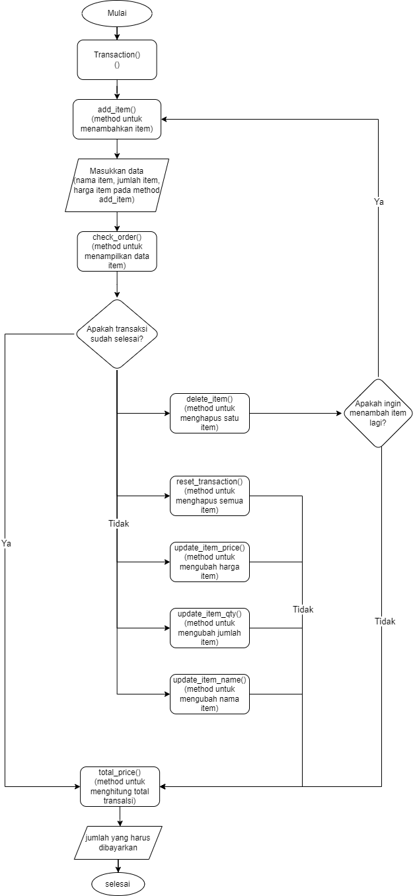

# 
<strong>Hi there :wave: , I'm Goo!</strong>

# PROJECT CASHIER

## A. Latar Belakang Masalah
Andi adalah seorang pemilik supermarket besar yang berlokasi di salah satu kota di Indonesia. Andi sedang merencanakan untuk melakukan ekspansi bisnis melalui implementasi sistem kasir self-service di supermarketnya. Hal ini bertujuan agar pelanggan dapat melakukan transaksi secara mandiri, seperti memasukkan item yang dibeli, menentukan jumlah, dan memanfaatkan fitur-fitur lain yang tersedia. Dengan adanya sistem kasir self-service ini, pelanggan yang berada di luar kota pun masih dapat melakukan pembelian produk dari supermarket Bapak Andi.

## B. Tools
### a. Language
- Python
### b. Libraries
- logging library
- tabulate
- Google colab

## C. Requirement / Objectives Program
1. Membuat objek kelas transaksi
   - `user = Transaction()`
2. Menambahkan item:
   - `add_item([<nama item>, <jumlah item>, <harga per item>])`
3. Update item jika terjadi kesalahan:
   - Update nama item: `update_item_name(<nama item>, <update nama item>)`
   - Update jumlah item: `update_item_qty(<nama_item>, <update jumlah item>)`
   - Update harga item: `update_item_price (<nama_item>, <update harga item>)`
4. Menghapus satu baris item :
   - `delete_item(<nama_item>)`
5. Menghapus seluruh item:
   - `reset.transaction()`  
6. Check apabila ada kesalahan input:
   - `check_order()`
7. Menghitung total belanja:
   - `total_price()`

## Objectives
User
# Objectives
- Menggunakan Python untuk membuat program kasir otomatis yang memungkinkan pengguna untuk melakukan operasi tambah, update, hapus, reset transaksi, check order, dan melakukan pembayaran.
- Memberikan pengalaman pengguna yang baik dengan antarmuka yang interaktif dan pemberian informasi yang jelas.

## E. Function atau atribut yang dibuat

| No  | Function             | Deskripsi                             |
| --- | -------------------- | ------------------------------------- |
| 1   | add_item()           | Input: Nama item, Jumlah item, Harga per item |
| 2  | update_item_name()   | Input:  nama item, item_baru           |
| 3   | update_item_qty()    | Input:  jumlah item, jumlah_baru         |
| 4   | update_item_price()  | Input:  harga item, harga_baru          |
| 5   | delete_item()        | Menghapus item satu baris                     |
| 6   | reset_transaction()  | Reset transaction/menghapus seluruh transkasi                 |
| 7   | check_order()        | Display: Menampilkan item, jumlah item, dan harga per item |
| 8   | total_price()        | Display: Menampilkan keseluruhan item beserta total harganya |

## Flowchart

## Explanation of Attributes and Methods

1. Atribut `items` memiliki `list type` yang digunakan untuk menyimpan semua item dalam transaksi.
2. Atribut `total_price` memiliki `float type`, yang digunakan untuk menyimpan total harga suatu barang setelah diskon.
3. Atribut `diskon` memiliki `tipe float` yang digunakan untuk menyimpan jumlah total diskon yang diperoleh.
4. Atribut `self.items` adalah referensi ke atribut items dalam instance (objek) yang dibuat.
5. Atribut `self.total_price` adalah referensi ke atribut `total_price` pada instance (objek) yang dibuat.
6. Atribut `self.discount` merupakan referensi atribut diskon pada instance (objek) yang dibuat.
7. Metode `add_item(self, item)` untuk `menambahkan item` ke transaksi ke dalam daftar item yang berisi tiga elemen, termasuk: `nama item [0], jumlah item [1], dan harga per item [2 ]`.
8. Metode `update_item_name(self, item_name, new_item)` digunakan untuk memperbarui nama item. Ini memiliki dua parameter, `nama_item` adalah nama `item` yang sudah ada sebelumnya, dan `item_baru` adalah nama `item baru`.
9. Metode `update_item_quantity(self, item_name, new_quantity)` digunakan untuk memperbarui jumlah `item`. Ini memiliki dua parameter, nama_item adalah nama item yang kuantitasnya ingin Anda perbarui, dan kuantitas_baru adalah jumlah item baru.
10. Metode `update_item_price(self, item_name, new_price)` digunakan untuk memperbarui harga barang. Ini memiliki dua parameter, `nama_barang` adalah nama barang yang harganya ingin Anda perbarui, dan harga_baru adalah harga barang baru.
11. Metode `delete_item(self, item_name)` untuk menghapus item dari transaksi. Parameter `item_name` adalah nama item yang ingin Anda hapus.
12. Metode `reset_transaction(self)` untuk mengosongkan atau menghapus semua item dari keranjang belanja.
13. Metode `check_order(self)` adalah metode untuk menampilkan seluruh pesanan yang telah dilakukan dalam bentuk tabel yang memuat `nomor barang, nama barang, jumlah barang, harga per barang, dan harga total` (perkalian jumlah barang dan harga per item).
14. `Calculate_total_price(self)` adalah metode untuk menghitung total harga dan diskon yang diperoleh dari semua item yang telah ditambahkan ke daftar item. Cara ini memproses diskon 10% jika total pembelian lebih dari Rp500.000,00, 8% jika total pembelian lebih dari Rp300.000,00, atau 5% jika total pembelian lebih dari Rp200.000,00.

# Test Case
## Test Case 1
Menambahkan 2 item menggunakan method `add_item`, melakukan chek order menggunakan method `check_order`, dan melakukan hitung total akhir menggunakan method `total_price.

**The output is:** 

## Test Case 2
Menghapus 1 item menggunakan method `delete_item`, melakukan chek order menggunakan method `check_order`, dan melakukan hitung total akhir menggunakan method `total_price.

**The output is:** 

## Test Case 3
Menghapus semua item menggunakan method `rest_transaction` dan melakukan chek order menggunakan method `check_order`.

**The output is:** 

## Test Case 4
Menambahkan 2 item lagi yang baru menggunakan method `add_item`, melakukan chek order menggunakan method `check_order`, dan melakukan hitung total akhir menggunakan method `total_price.

**The output is:** 

## Test Case 5
Mengudate 1 nama item menggunakan method `update_item_nama`, melakukan chek order menggunakan method `check_order`, dan melakukan hitung total akhir menggunakan method `total_price.

**The output is:** 

## Test Case 6
Mengudate 1 jumlah item menggunakan method `update_item_qty`, melakukan chek order menggunakan method `check_order`, dan melakukan hitung total akhir menggunakan method `total_price.

**The output is:** 

## Conclusion

Modul self cashier sudah dapat dipakai untuk mempermudah pengguna atau pelanggan.  Modul dapat dikembangkan kembali dengan penambahan fitur-fitur lainnya untuk semakin mempermudah pelanggan.

